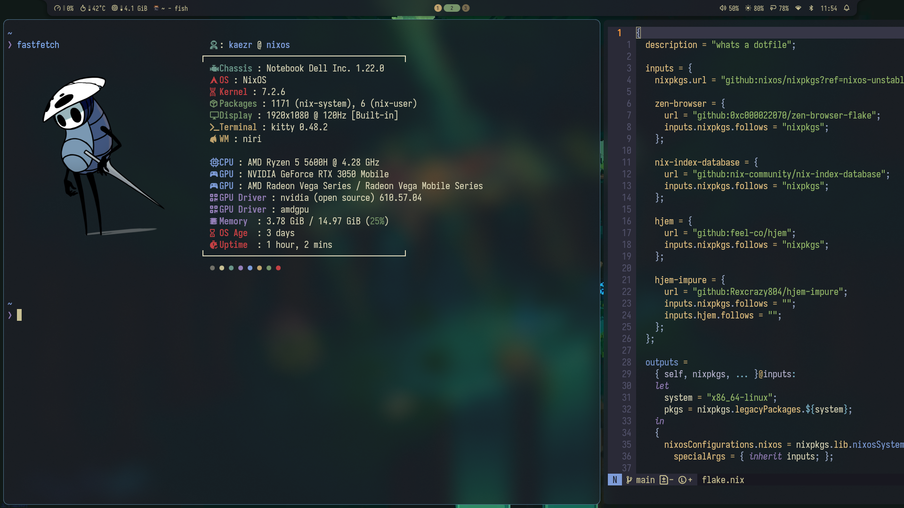

# .nixos




## Installation

```sh
git clone https://github.com/kaezrr/nix-oh-yes $HOME/.config/nixos
cd $HOME/.config/nixos

# Copy the hardware-configuration.nix that was generated for you machine because its machine specific
sudo cp /etc/nixos/hardware-configuration.nix ./hardware-configuration.nix
sudo nixos-rebuild switch --flake .#nixos
```
